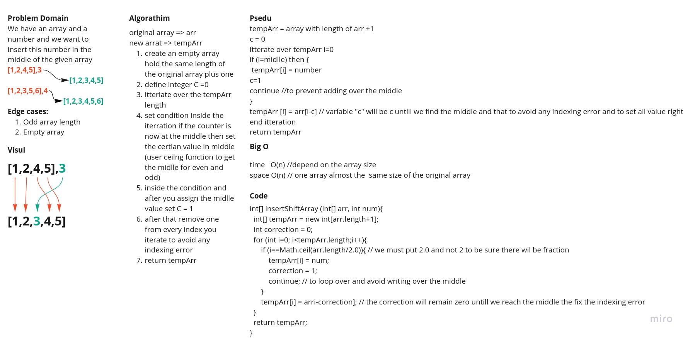
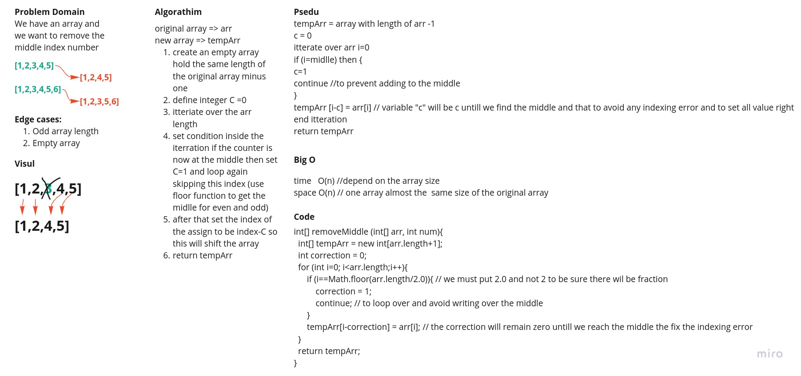

# Insert to Middle of an Array

This is a challenge to insert an element to the middle of an array without the built in method.

## Whiteboard Process Insert

## Approach & Efficiency Insert

i take an Approach iterate through the array and insert the element at the middle of the array.

Space Complexity: O(n) because we are creating a new array.
Time Complexity: O(n) because we are iterating through the array.

I think there is a better way of reducing the time complexity but i don't have an idea right now.

## Remove from The Middle of an Array -Stretch Goal-

This is a stretch goal to remove an element from the middle of an array without the built in method.

## Whiteboard Process Remove

## Approach & Efficiency Remove

i take an Approach iterate through the array and not adding the element at the middle to the return array.

Space Complexity: O(n) because we are creating a new array.
Time Complexity: O(n) because we are iterating through the array.

I think there is a better way of reducing the time complexity but i don't have an idea right now.
