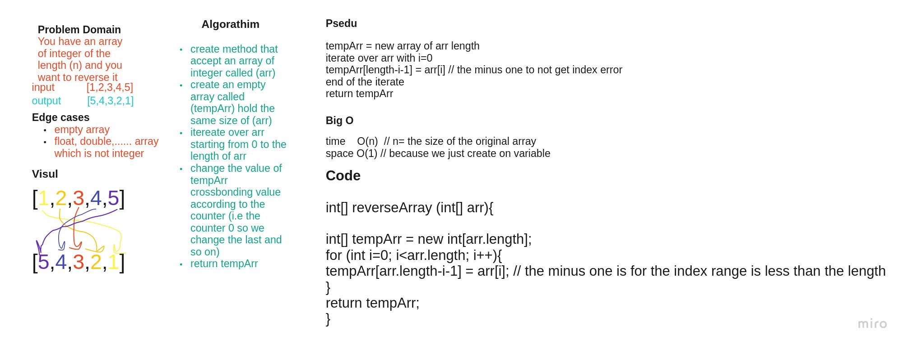

# Reverse an Array

The user will provide an array of integer, and the program will reverse the array.

## Whiteboard Process

## Approach & Efficiency

I solve this problem by iterating over the original array and reverse the index of the array.

and it's the best option for the resources and time.
