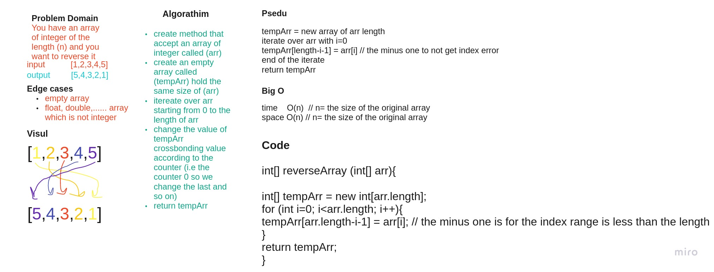
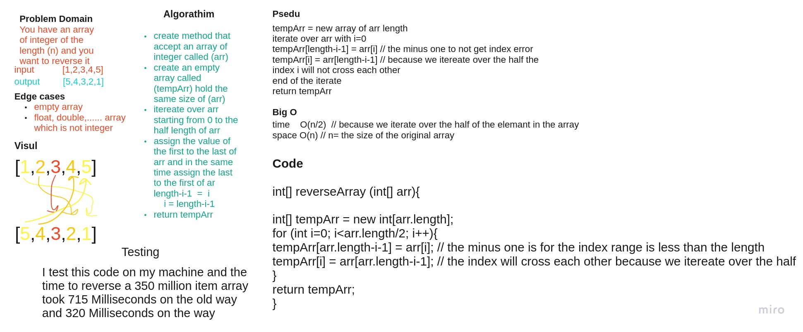

# Reverse an Array

The user will provide an array of integer, and the program will reverse the array.

## Whiteboard Process

## Approach & Efficiency

I solve this problem by iterating over the original array and reverse the index of the array.

and it takes O(n) time and O(n) space.

## Another way of approaching the solution

I solve this problem by iterating over the original array and reverse the first half of the index of the original array while in the same time reverse the second half of the index of the original array.

and this Approach will give us the same result with the same space complexity but will take half of the time and that's what we are looking for.

and it takes O(n/2) time and O(n) space.
