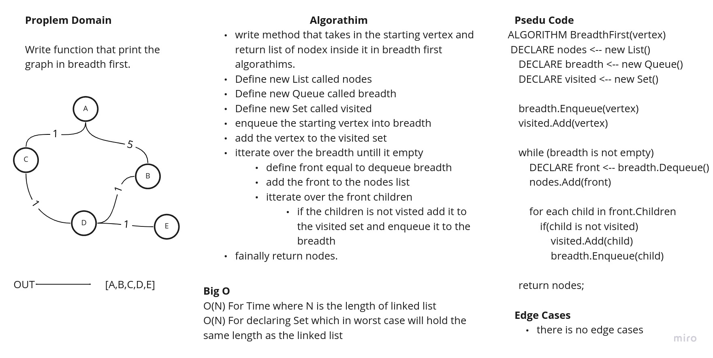
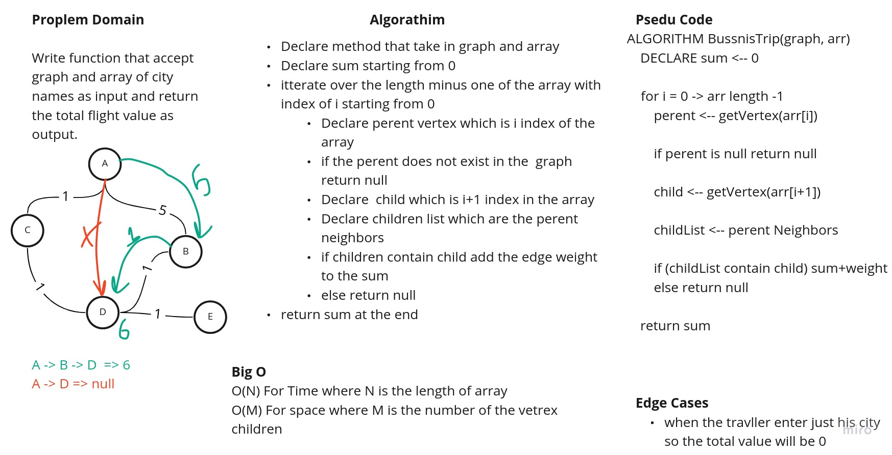
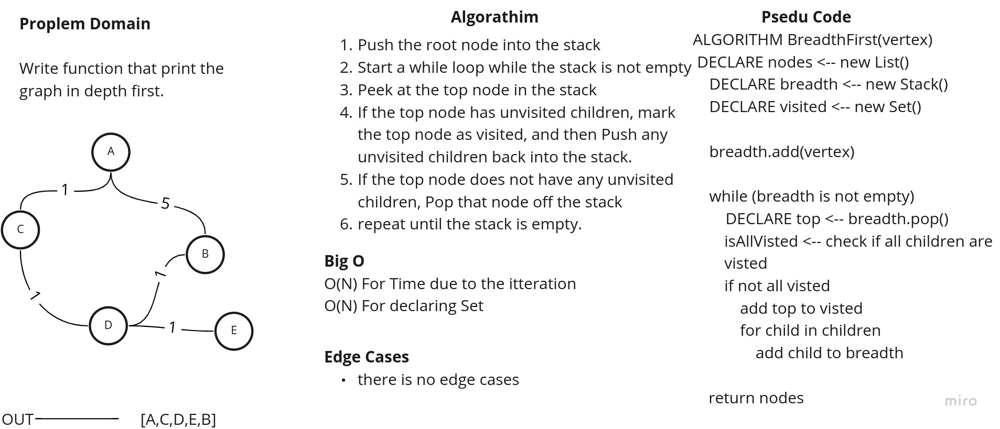

# Graph

This Java application contains a Graph implementation.

This Application is written in Java and contains the following classes:

- **App** Which contains the main method and the starting point of the application to run it write `$ gradle run`.
- **Graph** Class which contains the Graph implementation that use Vertex and Edge classes.
- **Vertex** Class which contains the Vertex (Node) implementation.
- **Edge** Class which contains the Edge implementation that will connect 2 Vertices.
- To run test for the whole application write `$ gradle test`.

## Challenge

This challenge is to implement the Graph using the Vertex and Edge classes and created by Mamoun Hussein for cc 35
java-401d5.

## Approach & Efficiency

- **addVertex** public method that will accept a generic value and return the created vertex, this method use O(1) for
  both time and space.
- **addEdge** public method that will return void and accept 2 Vertices and connect them with an edge and weight (
  optional), this method use O(1) for both time and space.
- **print** public method that will print the adjacency list for the graph this method use O(N*M) for time, where N is
  the number of Vertices and M is the number of neighbour of that Vertices and O(1) for space.
- **breadthFirst** method that will take a vertex as the head and return list of vertices in breadth first method, this
  method use O(N) for iterating over the item and O(N) for space for creating set.
- **businessTrip** method that will take a graph and city names as an array and return the total cost of the flight if
  possible and null if not this method use O(N) for time and O(M) for space where N is length of the array and M is the
  length of the children array
- **depthFirst** method that will take a vertex as the head and return list of vertices in depth first method, this
  method use O(N) for iterating over the item and O(N) for space for creating set.

## API

| #  | Method | Description |
| ----------- | ----------- | -----------|
|1| `Graph<T> graph = new Graph<>();`|declare and initialize a new empty graph |
|2| `Vertex<T> vertex = new Vertex<>(value)`|declare vertex with value|
|3| `Edge<T> edge = new Edge<>(startVertex, endVertex, ?weight)`| declare new edge between start and end where the weight is optional|
|4| `graph.addVertex(vertex)`|adding vertex to the graph|
|5| `graph.addEdge(start,end,?weight)`| adding edge between two vertices in that graph (the vertex should be already in the graph)|
|6| `graph.print()`|Print the graph using list|
|7| `graph.breadthFirst(vertex)`|return list containing vertices in breadth first method|
|8| `businessTrip(graph, cityNames)`|return cost of the flight (null if there is not)|
|9| `graph.depthFirst(vertex)`| return list containing vertices in depth first method|

## WhiteBoards

