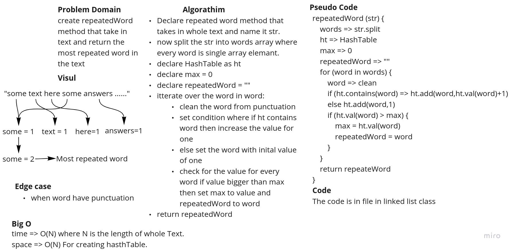
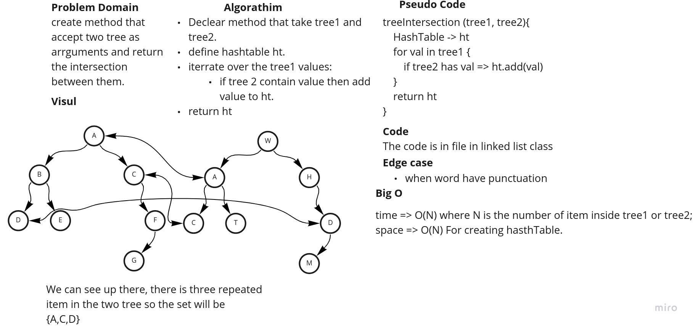

# Hash Table

This Java application contains a hash table implementation to store and retrieve data while doing some other methods.

This Application is written in Java and contains the following classes:

- **App** Which contains the main method and the starting point of the application to run it write `$ gradle run`.
- **HashTable** Class which contains the hash table implementation that use Bucket Class.
- **Bucket** Class which contains the bucket implementation that we use in the HashTable class.
- To run test for the whole application write `$ gradle test`.

## Challenge

This challenge is to implement the hash table using the bucket class and created by Mamoun Hussein for cc 30 java-401d5.

## Approach & Efficiency

- **hash** private Method that will return integer value according to ascii sum value of the key multiplied by 677 and
  modeled by the capacity of the hashtable this method use O(N) time complexity where N is the size of key and O(1)
  space complexity.
- **add** Method that will return void and hashing the key using hash method and add the key and value to the bucket.
  This method use O(N) time complexity where N is the length of the key and O(1) space complexity, this method will
  handle if the size of the table is the same as the capacity of the table.
- **get** Method that will return the value of the key if it exists in the table. This method use O(N) time complexity
  where N is the length of the key and O(1) space complexity.
- **contains** Method that will return true if the key exists in the table and false if it doesn't. This method use O(N)
  time complexity where N is the length of the key and O(1) space complexity.
- **repeatedWord** Method that will return the most repeated word in the text. This method use O(N) time complexity
  where N is the length of the text and O(N) space complexity.
- **treeIntersection** Method that will return the intersection of two trees. This method use O(N) time complexity
  where N is the size of the tree and O(N) space complexity.

## API

| #  | Method | Description |
| ----------- | ----------- | -----------|
|1| `HashTable<K,V> ht = new HashTable<>();`|declare and initialize a new empty hashtable instance with size 0 and 1 capacity |
|2| `ht.add(key, value)` | add the key and value to the table.|
|3| `ht.get(key)` | return the value of the key if it exists in the table.|
|4| `ht.contains(key)` | return true if the key exists in the table and false if it doesn't.|
|5| `repeatedWord(text)` | return the most repeated word in the text.|
|6| `treeIntersection(tree1, tree2)` | return the intersection of two trees.|

## WhiteBoard

