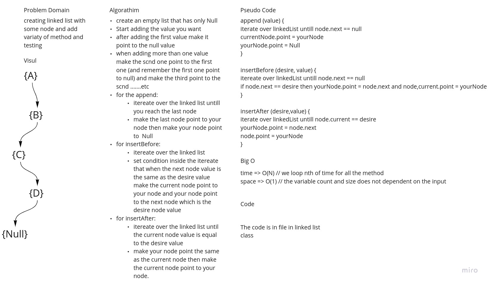
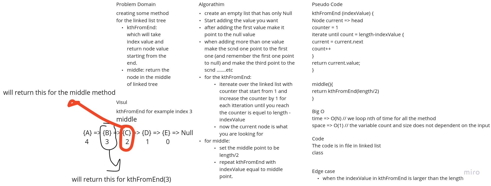
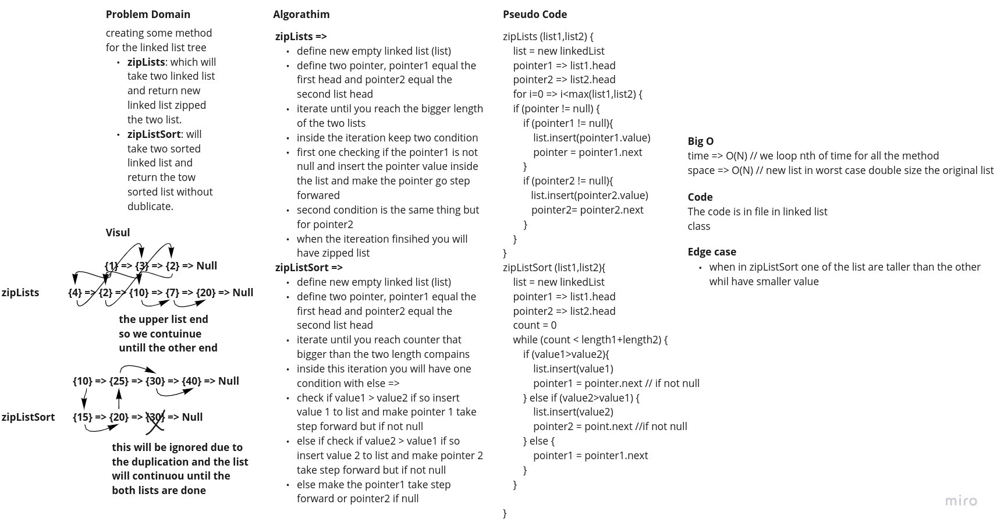

# Singly Linked List

This is an application to create and manipulate data structure using node and linked list

## Challenge

The challenge was creating the Node and Linked List from scratch and not using any built in method

And make it accept any data type -Java-Generic.

## Approach & Efficiency

For the **initialize** method will initialize the constructor, and it's auto generated when you create new
LinkedList,this method will take O(1) for both space and time because we are not looping through anything, and we just
create the constructor for the class.

For the **insert** method will take value and insert it in the head of the node LinkedList, this method will take O(1)
for both space and time again we are not looping or creating N variable - we are just inserting one data every time

For the **append** method will iterate over the linked list and when the next value is null it will insert the desire
Node and will make it point to null it takes O(N) for the time due to the full iteration and O(1) for the space because
we're just adding one Node

For the **insertBefore** method will iterate over the linked list until the next value is what we want to add before it,
After that we make the node we are one point to new node and make the new node point to the next node, so we can
continue the linked list idea this will take O(N) for time due to the full iteration and O(1) for space we're only
adding 1 Node

For the **insertAfter** method almost the same thing as insertBefore but we check the current Node value and make it
point to the new node and make the new node point to the next node so the linked list will continue this will take O(N)
for time due to the full iteration and O(1) for space we're only adding 1 Node

For the **delete** method will iterate over the linked list until the next point is the value we need to delete then
make the current node point to the node after the needed point so in general we can say we skip the value we need to
delete, it takes O(N) for time due the iteration and O(1) we don't create any variable.

For the **include** method will take a value and check if it's exist inside the whole node and return true if it's exist
and false otherwise,this method will take O(N) for Time because we are looping over all the LinkedList and O(1) for
space because we're not creating any variable.

For the **kthFromEnd** method will take indexValue and return the node value in that index in the linked list tree it
take O(N) depending on the index we need and O(1) we didn't create any variable

For the **middle** method this will return the node that in the middle and will take O(N) for time due the iteration and
O(1) for space because we didn't create any variable.

For the **toString** method will return string that contain all the value inside linked list in "{value} =>{value} =>
Null" Format, this method will take O(N) for time because we are looping through the whole Node and O(N) for space
because the string depends on the Linked List length

For the **zipLists** function takes two linked list as an arguments and merging them together in zip way and return the
new Linked list the length of the new one will be the length of the first one plus the length of the second this will
take O(N) for space where N the length of the bigger linked list and O(N) for space as we're appending inside the new
linked list

For the **zipListSort** function takes two sorted linked list as an argument and return new linked list in sorted way
with no duplication this will take O(N) for time depending on the linked lists length and O(N) for space because again
we are creating new linked list

## API

| #  | Method | usage |
| ----------- | ----------- | -----------|
| 1      | `LinkedList<T> linkedListName = new LinkedList<>()`       |initialize newLinkedList
| 2 | `linkedListName.insert(value)` |add new value to the first of linked list tree|
|3| `linkedList.append(value)` | append new value to the end of the linked list tree|
|4| `linkedList.insertBefore(indexValue,value)`|insert a value before the indexValue on the linked list tree|
|5| `linkedList.insertAfter(indexValue,value)`| insert a value after the indexValue on the linked list tree|
|6| `linkedLits.delete(value)`|delete the value from the linked list tree|
|7| `linkedList.include(value)`|return `true` only if the linkedList contain the input value otherwise will return `false`|
|8| `linkedList.kthFromEnd(indexValue)`| return the node value at the indexValue (head => length-1)|
|9| `linkedList.middle()`| return the middle node value of the linked list tree|
|10| `linkedList.toString()`| return formatted String showing the LinkedList value|
|11| `new App()<Integer>.zipLists(list1,list2)`| return new linked list containing these the two list zipped together|
|12| `new App()<Integer>.zipListSort(list1,list2)`| return new linked list containing these two list merged and sorted together|

### White Board.

- white board for append, insertBefore, insertAfter and delete.
  
- white board for kthFromEnd and middle
  
- white board for zipLists and zipListSort
  
