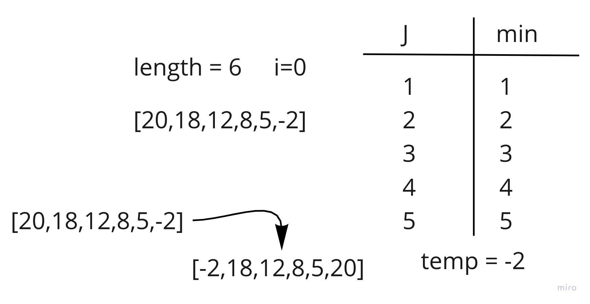
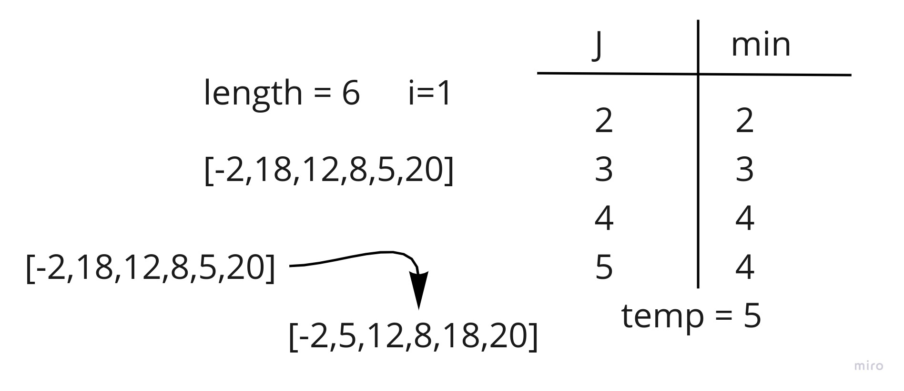
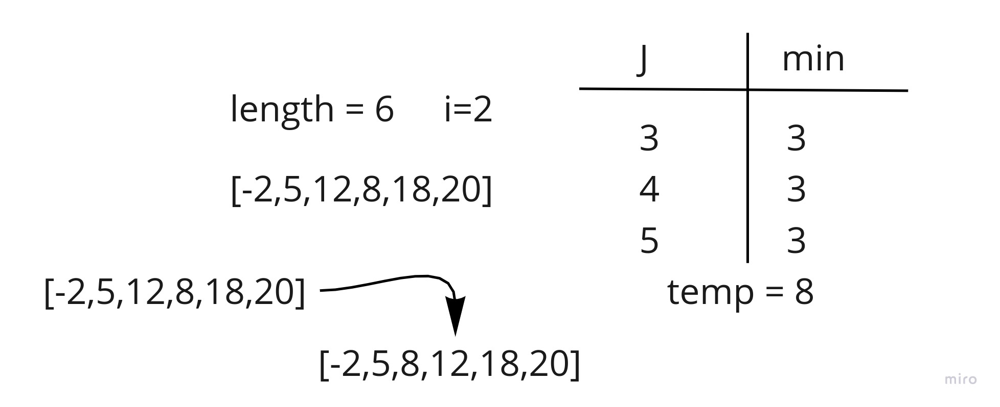
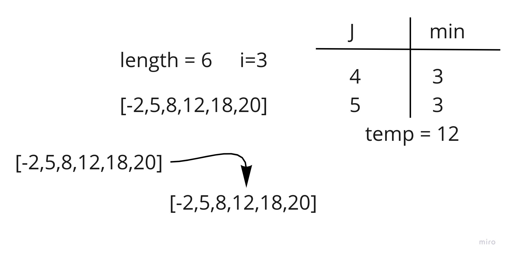
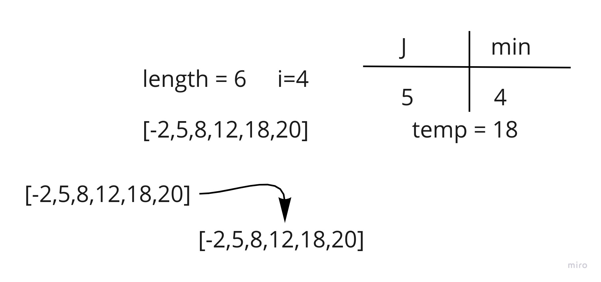
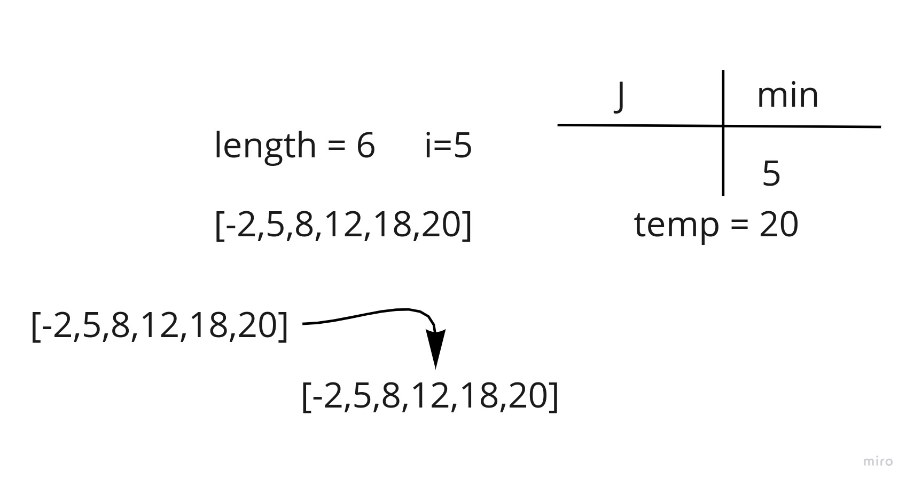

# Sort Methods and algorithm

This is a blog post for different type of sorting methods and algorithms.

- Contents:
  - [Selection Sort](#selection-sort)
  - [Merge Sort](#merge-sort)

## Selection Sort

This is a blog post for selection sort algorithm and the pseudocode.

#### Pseudocode

```pseduocode
SelectionSort(int[] arr)
    DECLARE n <-- arr.Length;
    FOR i = 0; i to n - 1
        DECLARE min <-- i;
        FOR j = i + 1 to n
            if (arr[j] < arr[min])
                min <-- j;

        DECLARE temp <-- arr[min];
        arr[min] <-- arr[i];
        arr[i] <-- temp;
```

#### Visualization



As we can see in this step where i=0, j will bee starting from 1 and iterate over the array, and the min will be the
first element, and it will change over the iteration, and it's final will be the last element.


In this Step i = 1, j will start from 2 and iterate over the array, and the min will be the first element, and it will
change over the iteration, and it's final will be the before last element.


In this Step i = 2, j will start from 3 and iterate over the array, and the min will be the first element, and it will
change over the iteration, and it's final will be the before before last element.


In this Step i = 3, j will start from 4 and iterate over the array, and the min will be the first element, and it will
change over the iteration, and it's final will remain the same.


In this Step i = 4, j will start from 5 and iterate over the array, and the min will be the first element, and it will
change over the iteration, and it's final will remain the same.


In this Step i = 5, j will start from 6 which is the length of the array and it will not loop over the array so the min
is the same as i.

## Merge Sort

This is a blog post for Merge sort algorithm and the pseudocode.

#### pseudocode

```
ALGORITHM Mergesort(arr)
    DECLARE n <-- arr.length

    if n > 1
      DECLARE mid <-- n/2
      DECLARE left <-- arr[0...mid]
      DECLARE right <-- arr[mid...n]
      // sort the left side
      Mergesort(left)
      // sort the right side
      Mergesort(right)
      // merge the sorted left and right sides together
      Merge(left, right, arr)

ALGORITHM Merge(left, right, arr)
    DECLARE i <-- 0
    DECLARE j <-- 0
    DECLARE k <-- 0

    while i < left.length && j < right.length
        if left[i] <= right[j]
            arr[k] <-- left[i]
            i <-- i + 1
        else
            arr[k] <-- right[j]
            j <-- j + 1

        k <-- k + 1

    if i = left.length
       set remaining entries in arr to remaining values in right
    else
       set remaining entries in arr to remaining values in left

```

#### Visualization

