# Sort Methods and algorithm

This is a blog post for different type of sorting methods and algorithms.

- Contents:
  - [Selection Sort](#selection-sort)
  - [Merge Sort](#merge-sort)

## Selection Sort

This is a blog post for selection sort algorithm and the pseudocode.

#### Pseudocode

```pseduocode
SelectionSort(int[] arr)
    DECLARE n <-- arr.Length;
    FOR i = 0; i to n - 1
        DECLARE min <-- i;
        FOR j = i + 1 to n
            if (arr[j] < arr[min])
                min <-- j;

        DECLARE temp <-- arr[min];
        arr[min] <-- arr[i];
        arr[i] <-- temp;
```

#### Visualization


As we can see in this step where i=0, j will bee starting from 1 and iterate over the array, and the min will be the
first element, and it will change over the iteration, and it's final will be the last element.


In this Step i = 1, j will start from 2 and iterate over the array, and the min will be the first element, and it will
change over the iteration, and it's final will be the before last element.


In this Step i = 2, j will start from 3 and iterate over the array, and the min will be the first element, and it will
change over the iteration, and it's final will be the before before last element.


In this Step i = 3, j will start from 4 and iterate over the array, and the min will be the first element, and it will
change over the iteration, and it's final will remain the same.


In this Step i = 4, j will start from 5 and iterate over the array, and the min will be the first element, and it will
change over the iteration, and it's final will remain the same.


In this Step i = 5, j will start from 6 which is the length of the array and it will not loop over the array so the min
is the same as i.

## Merge Sort

This is a blog post for Merge sort algorithm and the pseudocode.

#### pseudocode

```
ALGORITHM Mergesort(arr)
    DECLARE n <-- arr.length

    if n > 1
      DECLARE mid <-- n/2
      DECLARE left <-- arr[0...mid]
      DECLARE right <-- arr[mid...n]
      // sort the left side
      Mergesort(left)
      // sort the right side
      Mergesort(right)
      // merge the sorted left and right sides together
      Merge(left, right, arr)

ALGORITHM Merge(left, right, arr)
    DECLARE i <-- 0
    DECLARE j <-- 0
    DECLARE k <-- 0

    while i < left.length && j < right.length
        if left[i] <= right[j]
            arr[k] <-- left[i]
            i <-- i + 1
        else
            arr[k] <-- right[j]
            j <-- j + 1

        k <-- k + 1

    if i = left.length
       set remaining entries in arr to remaining values in right
    else
       set remaining entries in arr to remaining values in left

```

#### Visualization

Let's Sort this array [8,4,23,42,16,15] in merge sort.

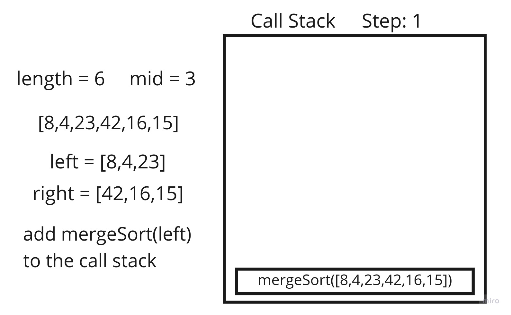

In this step the left side is [8,4,23] and the right side is [42,16,15] while the length is 6, now due to the recursive
call we will call the function again with param of left side [8,4,23].

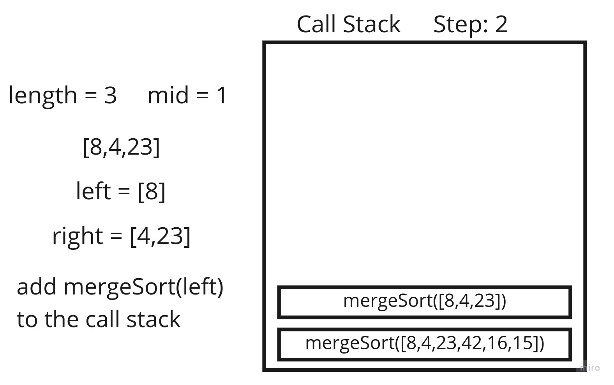

In this step we called the mergeSort function again with params of the left side as the whole array [8,4,23]
where the new left is [8] and the right side is [4,23] while the length is 3, now due to the recursive call we will call
the function again with param of left side [8].

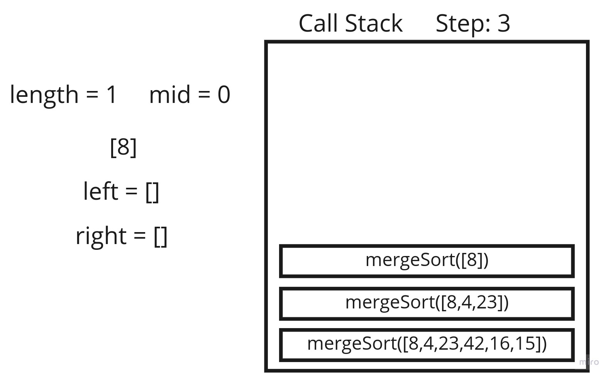

In this step we called the mergeSort function again with params of the left side as the whole array [8]  so nothing will
happen so from now on when we have one element we will not call it in recursion.

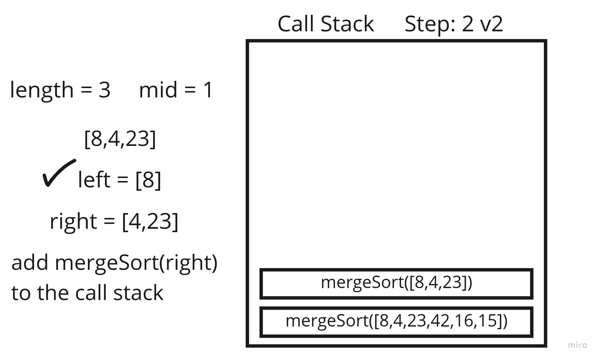

Now back to step 2 where we passed the left side, and now we continue with the right side [4,23] call it in recursion as
whole array

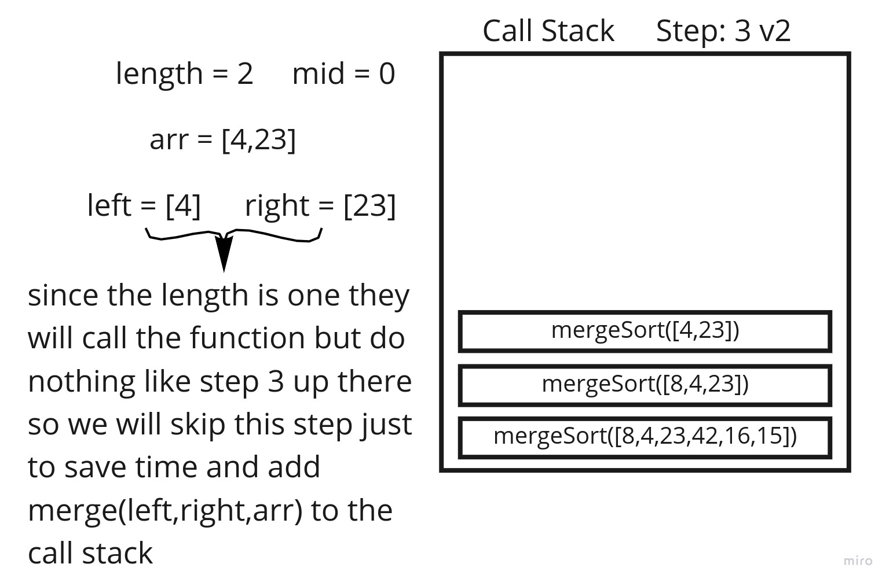

After we called the function with [4,23] as the whole array we can see the left is [4] and the right side is [23] we
will not call recursion again due the one element array, and we will call the merge function with left [4] , right [23]
and arr [4,23].

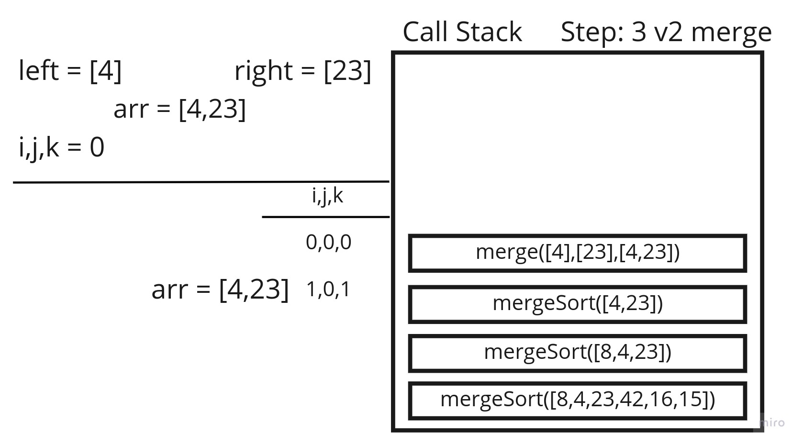

We enter the merge function with left [4] and right [23] and arr [4,23] and we declare i,j,k and we start the loop and
start assigning the left side to the arr and increment i, and right side to the arr and increment j.

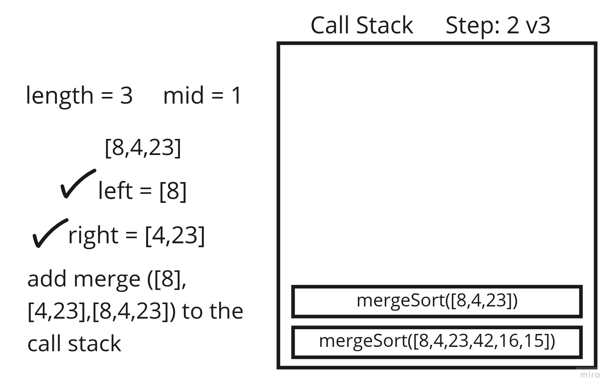
Back To step 2 where the left side and right side is sorted now we call the merge function with left is [8] and right
[4,23] and arr [8,4,23].

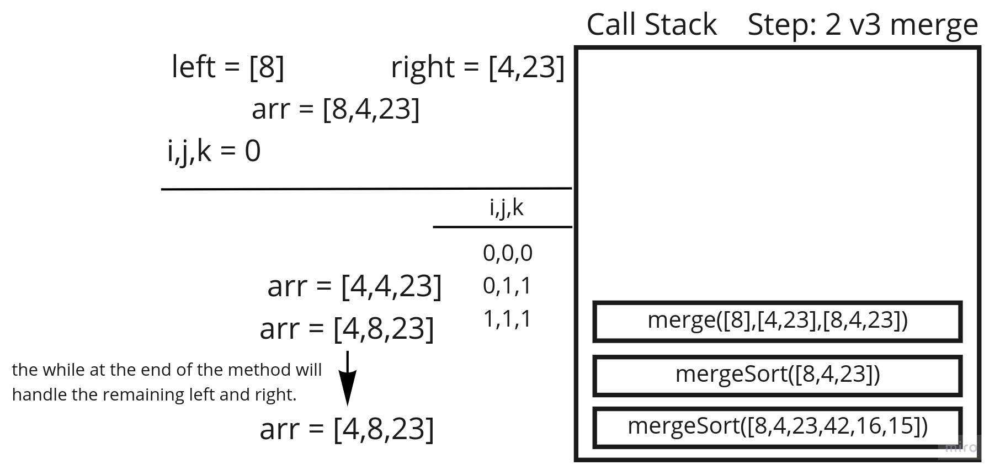
We enter the merge function with left [8] and right [4,23] and arr [8,4,23] and we declare i,j,k and we start the loop
and start assigning the left side to the arr and increment i, and right side to the arr and increment j.

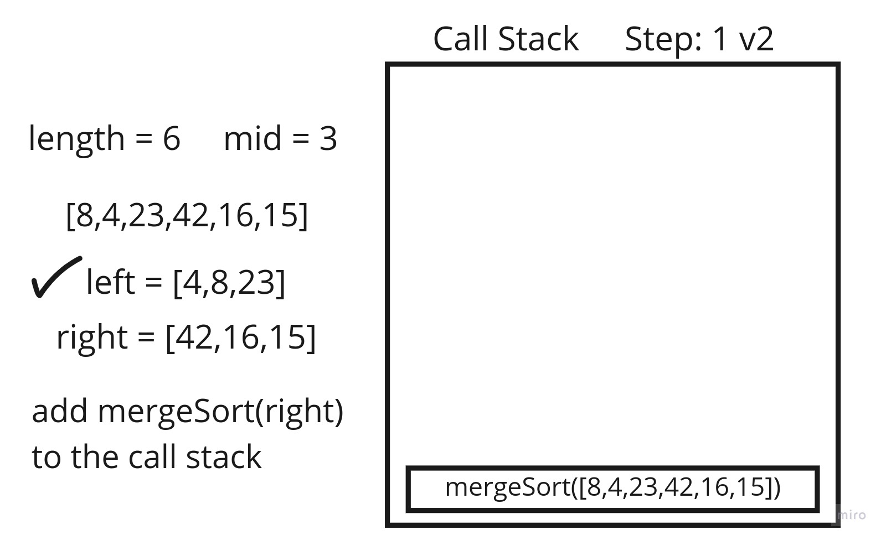
Back to step 1 where now the left side is sorted, and we will continue with the right side [42,16,15] call it in
recursion as whole array.

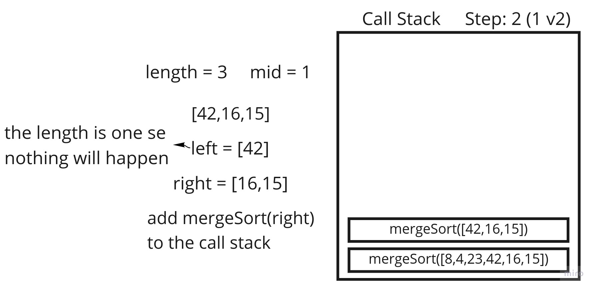
After we called the function with [42,16,15] as the whole array we can see the left is [42] and the right side is
[16,15] we will not call recursion again due the one element array, so we call the mergeSort function with [16,15] as
whole array .

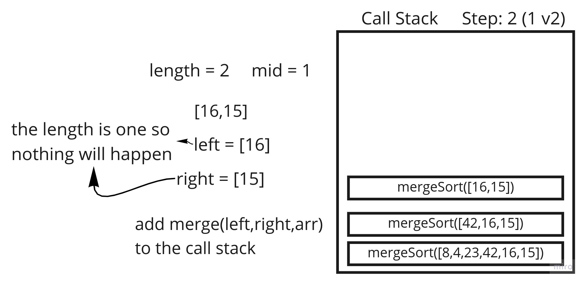
After we called the function with [16,15] as the whole array we can see the left is [16] and the right side is [15]
we will not call recursion again due the one element array, so we call the merge function where left is [16] and right
[15] and arr [16,15].

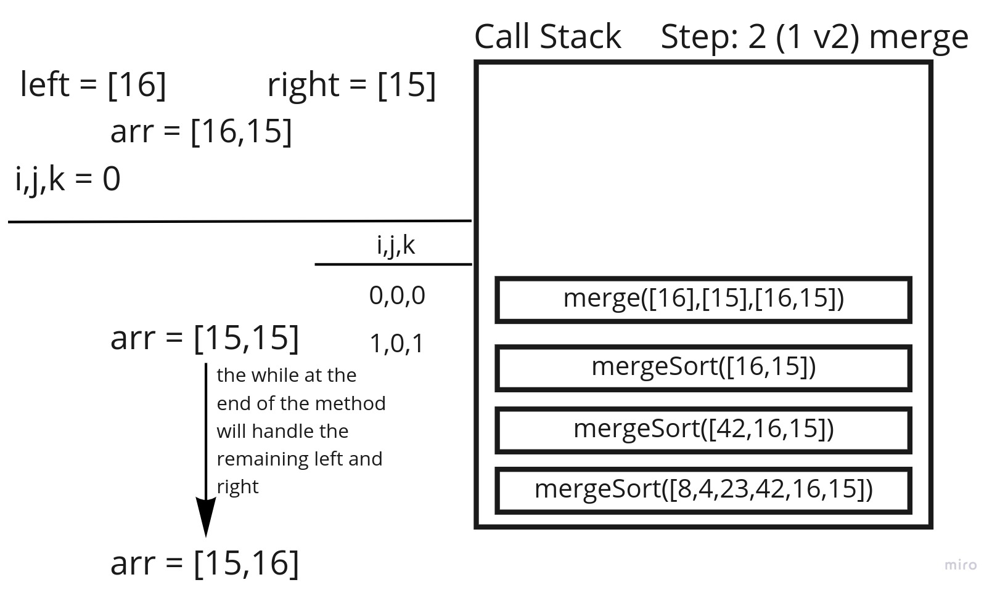
We enter the merge function with left [16] and right [15] and arr [16,15] and we declare i,j,k and we start the loop and
start assigning the left side to the arr and increment i, and right side to the arr and increment j.

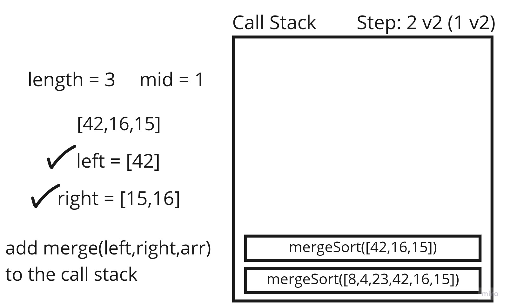
Back to step 10 where now the left and right side are sorted now we call the merge function with left is [42] and right
[15,16] and arr [42,16,15].

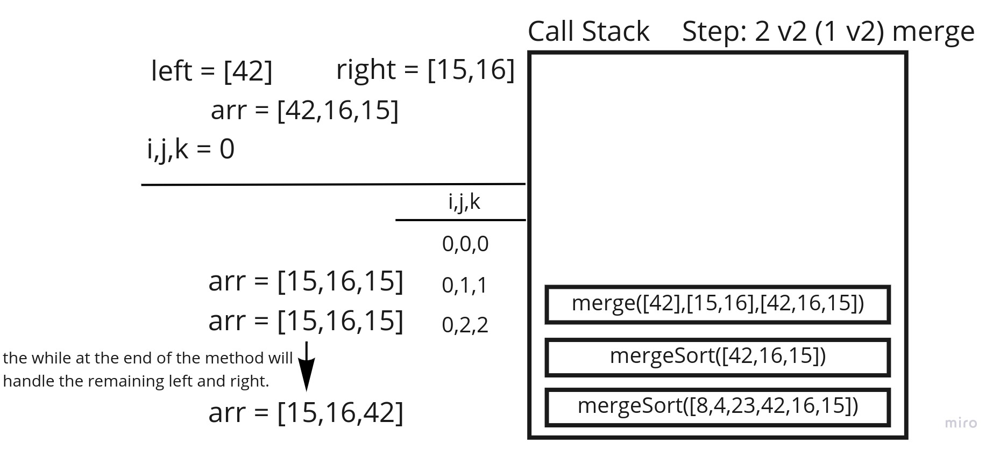
We enter the merge function with left [42] and right [15,16] and arr [42,16,15] and we declare i,j,k and we start the
loop and start assigning the left side to the arr and increment i, and right side to the arr and increment j.

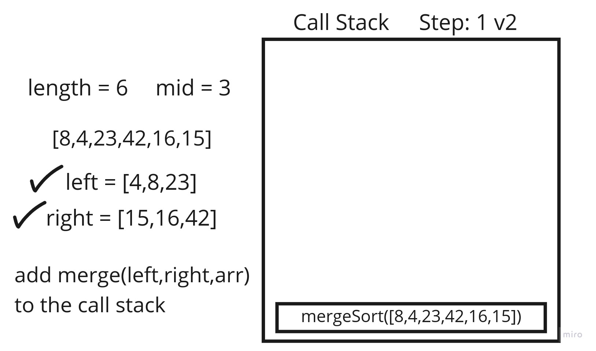
Back to step 1 where now the left and right side are sorted now we call the merge function with left is [4,8,23] and
right
[15,16,42] and arr [8,4,23,42,16,15] .

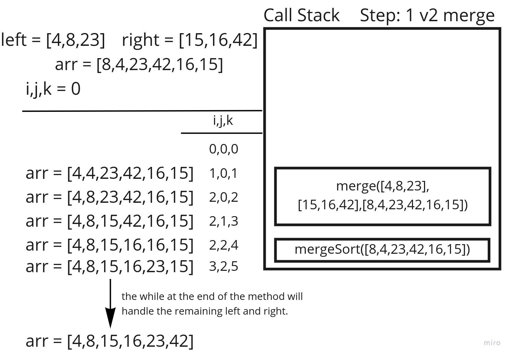
We enter the merge function with left [4,8,23] and right [15,16,42] and arr [8,4,23,42,16,15] and we declare i,j,k and
we start the loop and start assigning the left side to the arr and increment i, and right side to the arr and increment
j.

