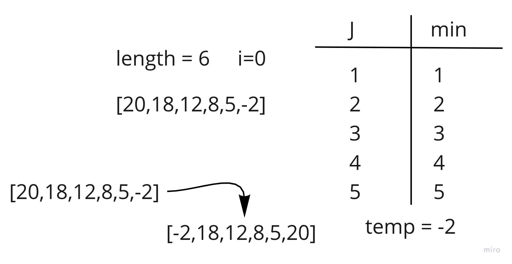
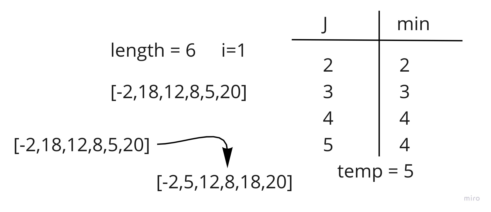
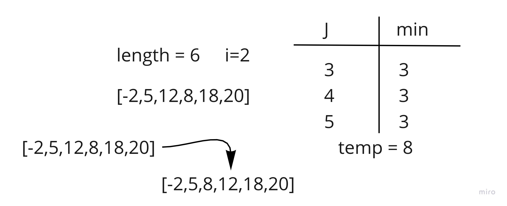
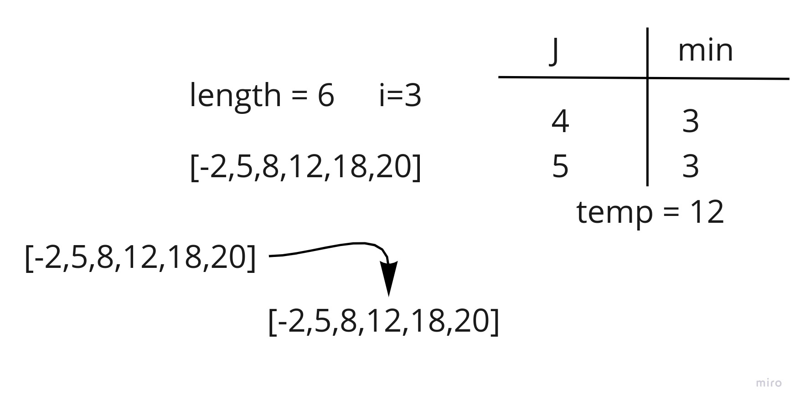
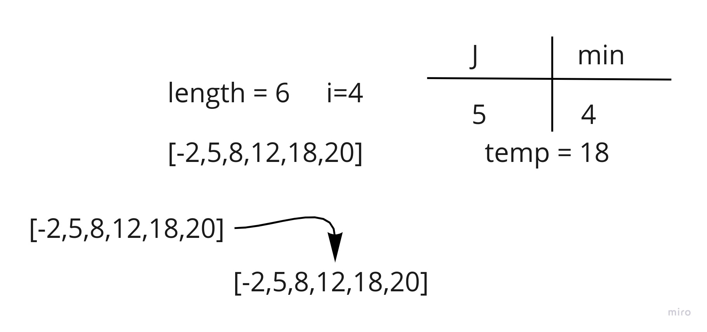
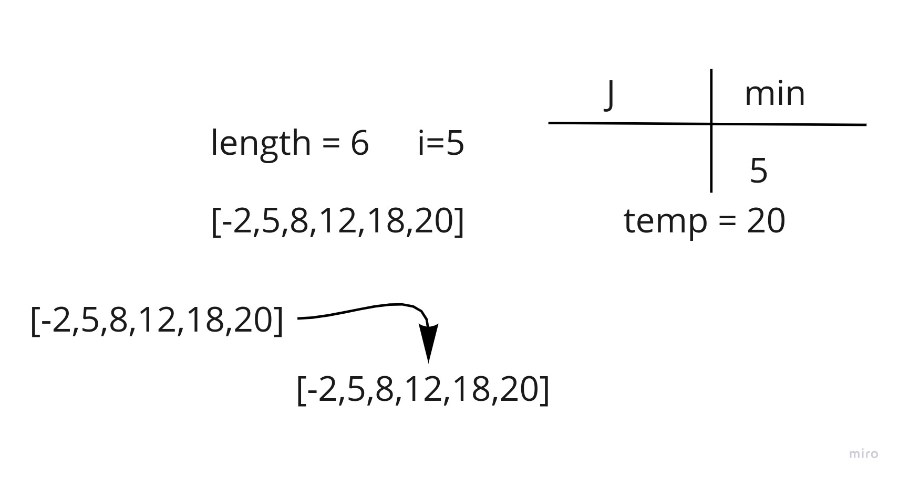

# Selection Sort (Blog)

This is a blog post for selection sort algorithm and the pseudocode.

## Pseudocode

```pseduocode
SelectionSort(int[] arr)
    DECLARE n <-- arr.Length;
    FOR i = 0; i to n - 1
        DECLARE min <-- i;
        FOR j = i + 1 to n
            if (arr[j] < arr[min])
                min <-- j;

        DECLARE temp <-- arr[min];
        arr[min] <-- arr[i];
        arr[i] <-- temp;
```

## Visualization



As we can see in this step where i=0, j will bee starting from 1 and iterate over the array, and the min will be the
first element, and it will change over the iteration, and it's final will be the last element.


In this Step i = 1, j will start from 2 and iterate over the array, and the min will be the first element, and it will
change over the iteration, and it's final will be the before last element.


In this Step i = 2, j will start from 3 and iterate over the array, and the min will be the first element, and it will
change over the iteration, and it's final will be the before before last element.


In this Step i = 3, j will start from 4 and iterate over the array, and the min will be the first element, and it will
change over the iteration, and it's final will remain the same.


In this Step i = 4, j will start from 5 and iterate over the array, and the min will be the first element, and it will
change over the iteration, and it's final will remain the same.


In this Step i = 5, j will start from 6 which is the length of the array and it will not loop over the array so the min
is the same as i.
