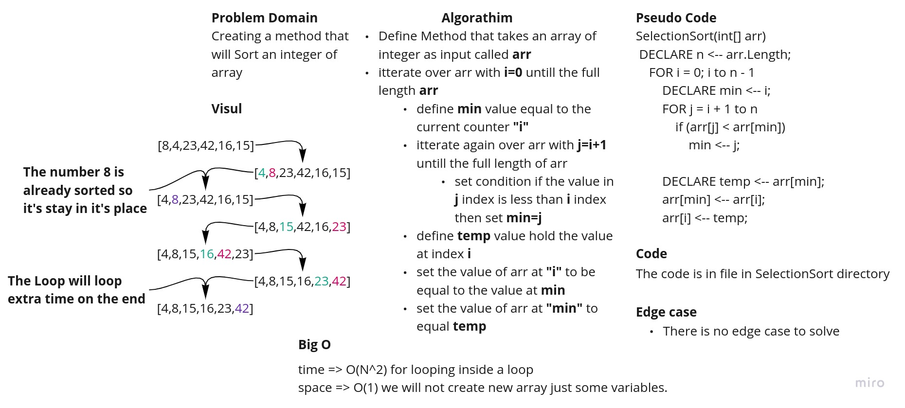
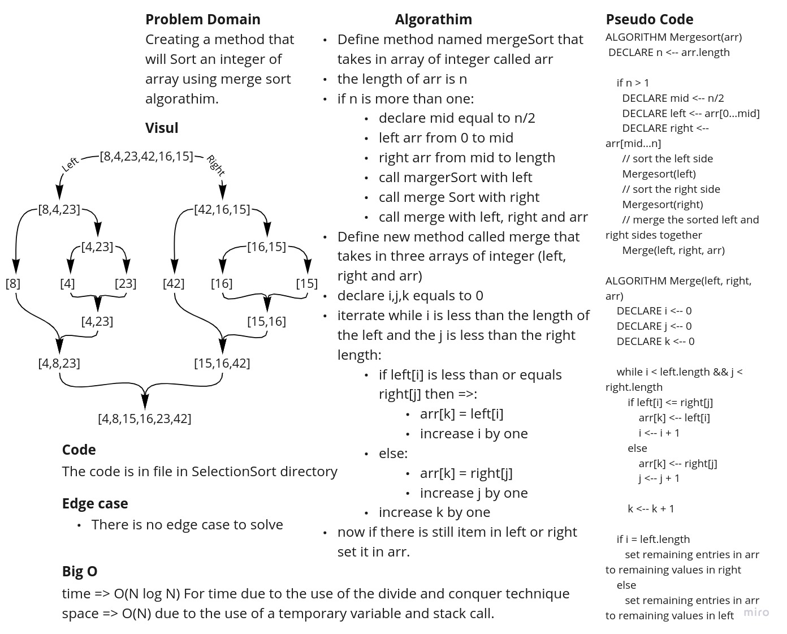
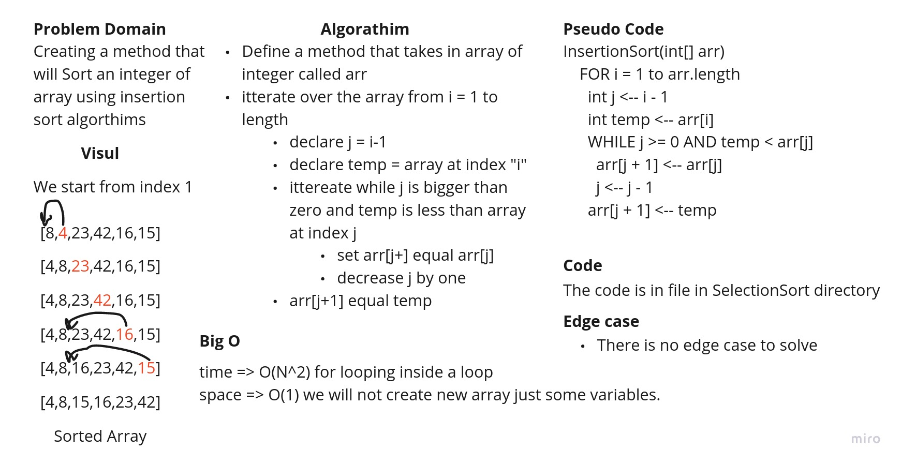

# Sort Algorithms

This is a sort algorithm and this file was created by [@Mamoon Hussein](https://web.facebook.com/mamoon.husen)
for Code challenge 26 for amman-java401d5.

This File Contains one class which is the App Class and three methods:

1. the main method which is the entry point of the program.
2. the selection sort method which will sort an array by selection sort algorithm.
3. the merge sort method which will sort an array by merge sort algorithm.
4. the insertion sort method which will sort an array by insertion sort algorithm.

## Whiteboard Process

- Selection Sort

  

- Merge Sort

  

- Insertion Sort

  

## Approach & Efficiency

For **selectionSort** method takes an array of integers as input and sorts it in ascending order, this method take's O(
N^2) For time due to nested loops and O(1) for space due to the use of a temporary variable.

For **mergeSort** method takes an array of integers as input and sorts it in ascending order, this method take's O(
N logN) For time due to the use of the divide and conquer technique and O(N) For space due to the use of a temporary
variable.

For **insertionSort** method takes an array of integers as input and sorts it in ascending order, this method take's O(
N^2) For time due to nested loops and O(1) For space due to the use of a temporary variable.

## Solution

To run This application run the following command:

`$ gradle run`

and to run the test unit run the following command:

`$ gradle test`

To see the BLOG post of this application [click here](./BLOG.md)
