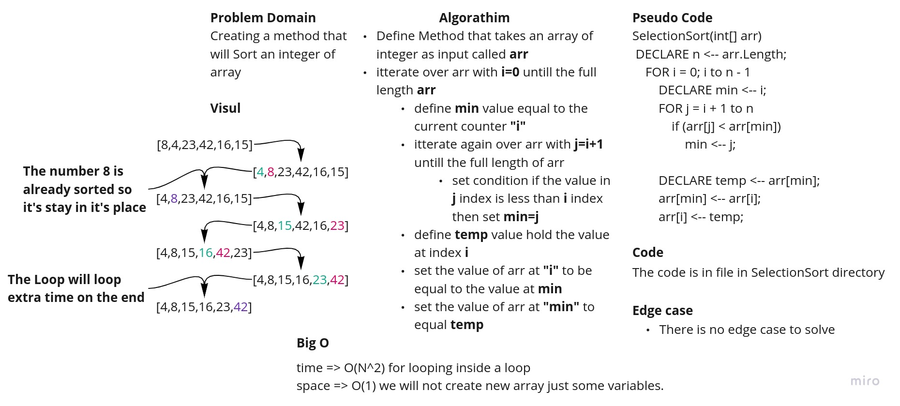

# Selection Sort

This is a selection sort algorithm and this file was created by [@Mamoon Hussein](https://web.facebook.com/mamoon.husen)
for Code challenge 26 for amman-java401d5.

This File Contains one class which is the App Class and two methods:

1. the main method which is the entry point of the program.
2. the sort method which is the core of the algorithm and will sort the input array.

## Whiteboard Process

## Approach & Efficiency

For **selectionSort** method takes an array of integers as input and sorts it in ascending order, this method take's O(
N^2) For time due to nested loops and O(1) for space due to the use of a temporary variable.

## Solution

To run This application run the following command:

`$ gradle run`

and to run the test unit run the following command:

`$ gradle test`

To see the BLOG post of this application [click here](./BLOG.md)
