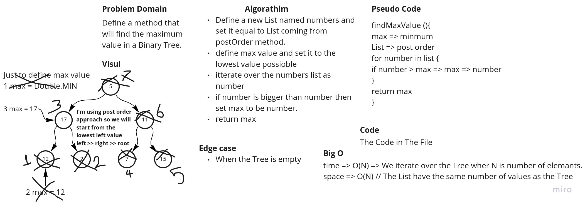

# Trees

This Challenge was created by Mamoun Hussein for cc15 java-401d5.

This file contains four classes:

* App => Which is the main starting point and will run on the command `$ gradle run`
* Node => A Generic Node type the has {Value, right and left} properties that we will use in Binary Tree.
* BinaryTree => A Generic Tree to represent a tree with node implementation and contains 4 method
  {preOrder,inOrder,PostOrder and toString} and we will talk about these methods upfront.
* BinarySearchTree => An extended version of Binary Tree that accept only numerical value that has two extra method {add
  and contains} and we will talk about these methods later.

## Challenge

The challenge was creating and manipulating Binary tree while using the least time and space complexity.

## Approach & Efficiency

* **preOrder** Method that will return an array list contain the items of the Tree in root >> left >> right that use
  recursion method of calling its function over and over until the tree is empty it uses O(N) for time due itteration
  and O(h) for space due call stack of function where h is the height of the tree where in the worst case h=N.
* **inOrder** Method that will return an array list contain the items of the Tree in left >> root >> right that use
  recursion method of calling its function over and over until the tree is empty it uses O(N) for time due itteration
  and O(h) for space due call stack of function where h is the height of the tree where in the worst case h=N.
* **PostOrder** Method that will return an array list contain the items of the Tree in left >> right >> root that use
  recursion method of calling its function over and over until the tree is empty it uses O(N) for time due itteration
  and O(h) for space due call stack of function where h is the height of the tree where in the worst case h=N.
* **breadthFirst** Method that return a list containing all the elements of the tree in breadth order parents =>
  children this method take O(N) For time and space due the iteration over the tree and creating of the list that
  containing the same number as the tree.
* **findMaximumValue** Method will return the maximum value in Binary Tree using the already produced array by the
  orders methods this approach work only with numbers and take O(N) for space and time due the iteration.
* **toString** Method that will return a String represent the tree in good shape and this will take O(N) for time and
  space.

---

Method that are only in BST:

* **add** Method that take a value and add it to the BST in the best shape possible this method take O(h) for time where
  h is the height of the tree and take O(1) for space there is no call stack in this.
* **contains** Method that take a value and return boolean determine weather the tree contains the inserted value or not
  this method take O(h) for time where h is the height of the tree and take O(1) for space there is no call stack in
  this.

## API

| #  | Method | usage |
| ----------- | ----------- | -----------|
|1| `binaryTree.preOrder(root)`| return array list of the item inside the tree in root >> left >> right order |
|2| `binaryTree.inOrder(root)`| return array list of the item inside the tree in left >> root >> right order |
|3| `binaryTree.postOrder(root)`| return array list of the item inside the tree in left >> right >> root order |
|4| `breadthFirst(tree)`| return array list of the item inside the tree in the breadth First Order|
|5| `binaryTree.toString(root)`| return String represent the tree |
|6| `binaryTree.findMaximumValue()`| return the maximum number in a tree **Work only with numerical value**|
|7| `binarySearchTree.add(value)`| add value to the BST in clean way (**Only in BST**) |
|8| `binarySearchTree.contains(value)`| return true or false weather the value is the BST or not (**Only in BST**) |

## White Board

White Board for finding the maximum value

white Board For Breadth First Method.

